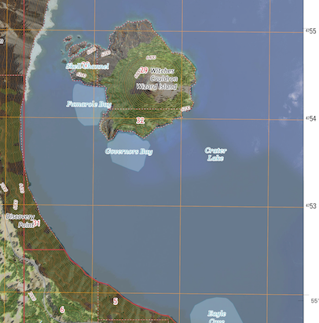
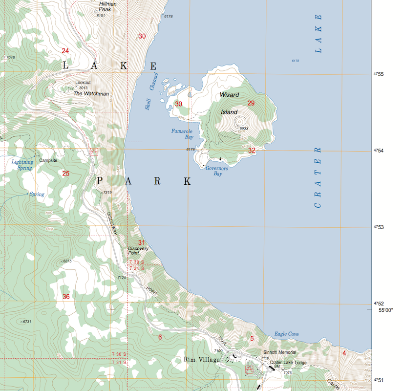

# GeoPDFs

This project shows how to process GeoPDFs from the [USGS](https://viewer.nationalmap.gov/basic/) and [USFS](https://data.fs.usda.gov/geodata/rastergateway/states-regions/states.php).  

## US Topo from US Geologic Survey

### US Topo of Wizard Island at Crater Lake National Park



### Process Examples

#### `gdalinfo`

Inspecting the response from `gdalinfo` with the option `-mdd` yields some interesting metadata.

```bash
# get GeoPDF of Crater Lake West
wget https://prd-tnm.s3.amazonaws.com/StagedProducts/Maps/USTopo/1/26110/8414580.pdf

gdalinfo -mdd LAYERS 8414580.pdf

LAYER_00_NAME=Map_Collar

LAYER_02_NAME=Map_Frame
LAYER_03_NAME=Map_Frame.Projection_and_Grids
LAYER_04_NAME=Map_Frame.Geographic_Names
LAYER_05_NAME=Map_Frame.Structures
LAYER_06_NAME=Map_Frame.Transportation

LAYER_12_NAME=Map_Frame.PLSS
LAYER_13_NAME=Map_Frame.Hydrography
LAYER_14_NAME=Map_Frame.Terrain
LAYER_15_NAME=Map_Frame.Terrain.Contours
LAYER_16_NAME=Map_Frame.Terrain.Shaded_Relief
LAYER_17_NAME=Map_Frame.Woodland
LAYER_18_NAME=Map_Frame.Boundaries

LAYER_28_NAME=Images
LAYER_29_NAME=Images.Orthoimage
LAYER_30_NAME=Barcode

```


##### PDF Dimensions

* PDF dimensions

```
Size is 3412, 4350
```

* Opening in a usual PDF viewer shows the image dimensions

```
22.75 × 29 inches
```

* Doing the math yields 150 pixels per inch.

#### `gdal_translate`

* Convert to GeoTIFF,

``` bash
DPI=300
gdal_translate 8414580.pdf 8414580.$DPI.tif \
  -co COMPRESS=LZW \
  --config GDAL_PDF_DPI $DPI

# Extract
gdalwarp 8414580.$DPI.tif 8414580.$DPI.wizard-island.tif \
  -t_srs EPSG:4326 -dstalpha \
  -co COMPRESS=LZW \
  -te -122.17833 42.92361 -122.13799 42.95766


gdal_translate 8414580.pdf 8414580.$DPI.Shaded_Relief.tif \
  -co COMPRESS=LZW \
    --config GDAL_PDF_LAYERS "Map_Collar.Map_Elements,Map_Frame.Terrain.Shaded_Relief" \
  --config GDAL_PDF_DPI $DPI

gdalwarp 8414580.$DPI.Shaded_Relief.tif 8414580.$DPI.Shaded_Relief.wizard-island.tif \
  -co COMPRESS=LZW \
  -t_srs EPSG:4326 -dstalpha \
  -te -122.17833 42.92361 -122.13799 42.95766

```


### Links

* Larry Moore, USGS, 2016 — [Converting US Topo GeoPDF Layers to GeoTIFF](https://nationalmap.gov/ustopo/documents/ustopo2gtif_current.pdf)
* Andrew Burnes, FOSS4G North America, 2016 — [Using GDAL
to Translate
US Topo GeoPDFs](https://2016.foss4g-na.org/sites/default/files/slides/using-gdal-to-translate-us-topo-geopdf.pdf)
* [roblabs/gdal](https://hub.docker.com/r/roblabs/gdal/)

### Background
> The term “US Topo” refers specifically to quadrangle topographic maps published in 2009 and later. [source][1]

Excerpt from October 2017

> In 2017, the US Topo map production system was redesigned and modernized to provide a system that facilitates long term goals for more efficient production and continued product improvements. The new system produces maps in a format that uses a different georeferencing mechanism compliant with ISO 32000. The new products can continue to be viewed and printed with Adobe Reader or any comparable PDF viewing software. [source][2]


-----

## FSTopo from US Forest Service

### Wizard Island at Crater Lake National Park



### Process Examples

#### `gdalinfo`
```bash
# get GeoPDF of Crater Lake West
wget https://data.fs.usda.gov/geodata/rastergateway/data/42122/fstopo/425212207_Crater_Lake_West_FSTopo.pdf

gdalinfo -mdd LAYERS 425212207_Crater_Lake_West_FSTopo.pdf

```


Comments attempting to document the significant layers.  Some sublayers removed; run `gdalinfo` for the full details.

```bash
Metadata (LAYERS):
  LAYER_00_NAME=Other_5   # Declination, scale and legend
  LAYER_01_NAME=Quadrangle_Extent

  LAYER_06_NAME=Adjacent_Quadrangle_Diagram

  LAYER_12_NAME=Other_2  # Quad label
  LAYER_13_NAME=Quadrangle
  LAYER_14_NAME=Quadrangle.Other
  LAYER_15_NAME=Quadrangle.Labels

  LAYER_17_NAME=Quadrangle.Neatline/Mask

  LAYER_21_NAME=Quadrangle.Text
  LAYER_22_NAME=Quadrangle.Road_Shields
  LAYER_23_NAME=Quadrangle.Buildings
  LAYER_24_NAME=Quadrangle.Culture_Features
  LAYER_25_NAME=Quadrangle.Drainage_Features
  LAYER_26_NAME=Quadrangle.Spot_Elevations
  LAYER_27_NAME=Quadrangle.Geodetic_Control
  LAYER_28_NAME=Quadrangle.Recreation/Facility_Features
  LAYER_29_NAME=Quadrangle.Linear_Transportation_Features
  LAYER_30_NAME=Quadrangle.Linear_Culture_Features
  LAYER_31_NAME=Quadrangle.PLSS
  LAYER_32_NAME=Quadrangle.Linear_Drainage_Features
  LAYER_33_NAME=Quadrangle.Contour_Labels
  LAYER_34_NAME=Quadrangle.Contours

  LAYER_38_NAME=Quadrangle.UTM_Grid

  LAYER_42_NAME=Quadrangle.Large_Buildings
  LAYER_43_NAME=Quadrangle.Drainage_Polygons
  LAYER_44_NAME=Quadrangle.WoodlandUSGS_P
```

#### `gdal_translate`

``` bash
DPI=300

gdal_translate 425212207_Crater_Lake_West_FSTopo.pdf 425212207_Crater_Lake_West_FSTopo.$DPI.tif \
  -co COMPRESS=LZW \
  --config GDAL_PDF_DPI $DPI

gdalwarp 425212207_Crater_Lake_West_FSTopo.$DPI.tif 425212207_Crater_Lake_West_FSTopo.$DPI.wizard-island.tif \
  -co COMPRESS=LZW \
  -t_srs EPSG:4326 -dstalpha \
  -te -122.17833 42.92361 -122.13799 42.95766
```

### Links

* [FSTopo](https://data.fs.usda.gov/geodata/vector/index.php)
* [roblabs/gdal](https://hub.docker.com/r/roblabs/gdal/)


### Background

> FSTopo is the Forest Service Primary Base Map Series (1:24,000 scale for the lower 48 and Puerto Rico, 1:63,360 for Alaska) quadrangle maps. FSTopo products cover the US Forest Service lands.

[1]: https://nationalmap.gov/ustopo/index.html
[2]: https://nationalmap.gov/ustopo/about.html
